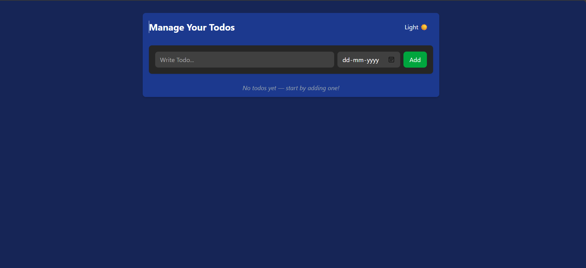
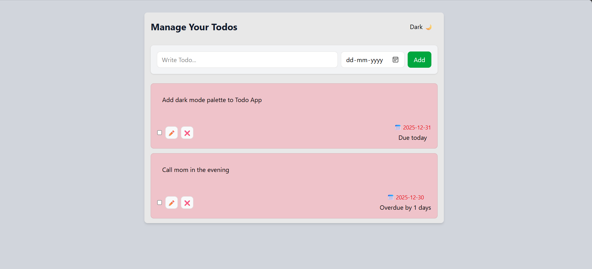
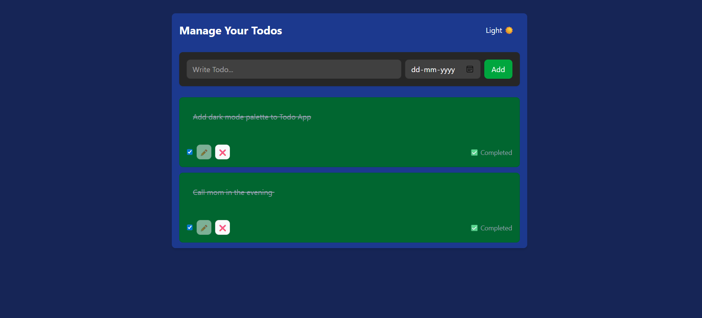
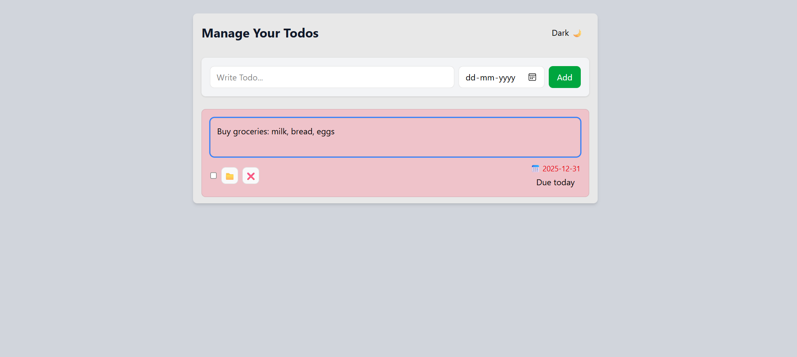

# Todo App 📝

A modern, responsive Todo application built with React, Redux, and Tailwind CSS. Designed with accessibility, dark mode support, and recruiter‑ready polish.

## 🔗 Live Demo

👉 [Todo App on Vercel](https://todo-app-zeta-hazel.vercel.app)

---

## 🚀 Features

- Add, edit, and delete tasks
- Responsive layout for mobile and desktop
- Dark mode palette with layered backgrounds
- Persistent state using Redux + localStorage
- Clean separation of concerns with modular hooks and slices

---

## 🛠️ Tech Stack

- **Frontend:** React, Redux Toolkit, Vite
- **Styling:** Tailwind CSS (custom config, dark mode)
- **Deployment:** Vercel
- **Version Control:** Git/GitHub

---

## 📦 Installation

```bash
git clone https://github.com/ViditTyagi17/todo-app.git
cd todo-app
npm install
npm run dev

```

## 🔧 Scripts

The following scripts are available in package.json:

- npm run dev → Start development server
- npm run build → Build for production
- npm run preview → Preview production build locally
- npm run lint → Run ESLint checks for code quality

---

## 🔑 Key Implementation Notes

- **Single-page layout:** All task management (add, edit, delete, mark complete) happens inline without navigation.
- **Task display with deadlines:**
  - Each todo can optionally include a **due date**.
  - The app automatically calculates and shows **how many days are left** until the deadline.
  - When a task is completed, the deadline is hidden and the task is marked as **Completed**.
  - If the deadline passes without completion, the task is flagged as **Overdue**.
- **State persistence:** Tasks and deadlines are stored in Redux and synced with localStorage, so they remain after page reloads.
- **Dark mode:** Todos, inputs, and deadline indicators adapt to layered dark mode palettes for accessibility and recruiter impact.
- **Responsive design:** Input fields, buttons, and the todo list scale smoothly from mobile to desktop.

---

## 📂 Project structure

```
todo-app/
├── public/                      # Static assets (screenshots, favicon, etc.)
│   └── screenshots/             # App screenshots for README
├── src/                         # Source code
│   ├── components/              # Reusable UI components
│   │   ├── ThemeSwitcher.jsx    # Dark/light mode toggle
│   │   ├── TodoForm.jsx         # Input form for adding todo
│   │   └── TodoItem.jsx         # Individual todo display with actions
│   ├── features/                # Redux slices and custom hooks
│   │   ├── themeSlice.js        # Theme state management
│   │   ├── todoSlice.js         # Todo state and logic
│   │   └── useTheme.js          # Custom hook for theme toggling
│   ├── App.jsx                  # Root component
│   ├── index.css                # Global styles
│   ├── main.jsx                 # Entry point
│   └── store.js                 # Redux store configuration
├── .gitignore                   # Files to ignore in Git
├── eslint.config.js             # ESLint rules
├── index.html                   # Vite entry HTML
├── package.json                 # Project metadata and scripts
├── package-lock.json            # Dependency lock file
├── README.md                    # Project documentation
└── vite.config.js               # Vite configuration
```

---

## 🧪 Linting and Quality

- ESLint: React and hooks rules enabled
- Scripts: npm run lint to check code quality

---

## 💡 Challenges Solved

- Accessible dark mode: Designed layered color hierarchies for readability and recruiter impact.
- Lifecycle debugging: Fixed timing issues in state persistence to ensure smooth UX.
- Layout refactor: Organized components and styling for recruiter‑ready presentation.
- Responsive inputs: Implemented adaptive input and textarea for mobile‑first design.

---

## 📸 Screenshots

### Empty State



### Active Todos (Light Mode)



### Completed Todos (Dark Mode)



### Editing Todo



---

## 👨‍💻 Author

- Vidit Tyagi — Aspiring Web Developer focused on recruiter-ready projects
- GitHub: https://github.com/ViditTyagi17

---
